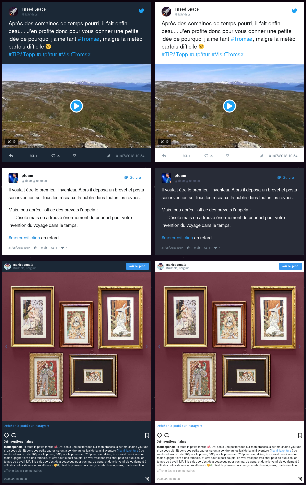

# Static Social Embeds Plugin

The **Static Social Embeds** Plugin is for [Grav CMS](http://github.com/getgrav/grav). It embeds social status (like tweets, instagram posts, toots, etc.) in articles without using their embed iframe, but rather statically without any dependency to the service.

The following networks are supported ([see below](#usage) for details):

- [Twitter](https://twitter.com);
- [Mastodon](https://joinmastodon.org) and [Pleroma](https://pleroma.social);
- [Instagram](https://www.instagram.com).

## Installation

Installing the Static Social Embeds plugin can be done in one of two ways. The GPM (Grav Package Manager) installation method enables you to quickly and easily install the plugin with a simple terminal command, while the manual method enables you to do so via a zip file.

### GPM Installation (Preferred)

The simplest way to install this plugin is via the [Grav Package Manager (GPM)](http://learn.getgrav.org/advanced/grav-gpm) through your system's terminal (also called the command line).  From the root of your Grav install type:

    bin/gpm install static-social-embeds

This will install the Static Social Embeds plugin into your `/user/plugins` directory within Grav. Its files can be found under `/your/site/grav/user/plugins/static-social-embeds`.

### Manual Installation

To install this plugin, just download the zip version of this repository and unzip it under `/your/site/grav/user/plugins`. Then, rename the folder to `static-social-embeds`. You can find these files on [GitHub](https://github.com/amaury-carrade/grav-plugin-static-social-embeds) or via [GetGrav.org](http://getgrav.org/downloads/plugins#extras).

You should now have all the plugin files under

    /your/site/grav/user/plugins/static-social-embeds
	
> NOTE: This plugin is a modular component for Grav which requires [Grav](http://github.com/getgrav/grav), the [Error](https://github.com/getgrav/grav-plugin-error), [Problems](https://github.com/getgrav/grav-plugin-problems) and [Shortcode Core](https://github.com/getgrav/grav-plugin-shortcode-core) plugins to operate. Also, the [CURL PHP extension](https://secure.php.net/curl) must be enabled for this plugin to work.

### Admin Plugin

If you use the admin plugin, you can install directly through the admin plugin by browsing the `Plugins` tab and clicking on the `Add` button.

## Configuration

Before configuring this plugin, you should copy the `user/plugins/static-social-embeds/static-social-embeds.yaml` to `user/config/plugins/static-social-embeds.yaml` and only edit that copy.

Note that if you use the admin plugin, a file with your configuration, and named static-social-embeds.yaml will be saved in the `user/config/plugins/` folder once the configuration is saved in the admin.

Here is the default configuration and a short explanation of available options. Extensive explanations are available in the admin page of the plugin.

```yaml
enabled: true

# The plugin ships its own JS and CSS to run the static embeds.
# If you want to provide your own, feel free to disable them.
built_in_css: true
built_in_js: true

# If your theme does not provide Font Awesome 5, required for
# the default embeds to work, check this.
include_font_awesome_5: true


# Options for all networks
#
# -- theme --
# The embed theme: with the default CSS, matches the light & dark
# themes for the related network, except for Instagram (which does not
# have a dark theme), where the dark theme colours are inspired by Twitter.
#
# -- downloaded_content --
# The plugin can download images, videos, and GIFs, to ensure a
# complete independence from the social networks, at the cost of
# some disk space. This includes avatars and custom emojis (if any).


twitter:
  theme: light

  # Please not that if false, Firefox will block Twitter images from loading by default (for privacy reasons).
  download_content:
    images: true
    videos: true

  # API credentials required to load tweets (an explanation on how to create an application is available below).
  consumer_key: null
  consumer_secret: null
  access_token: null
  access_token_secret: null


mastodon:
  theme: light

  download_content:
    images: true
    videos: true


instagram:
  theme: light

  # Please not that if false, Firefox will block Instagram images from loading by default (for privacy reasons).
  # Please also note that as Instagram's images CDN URLs may expire, you should keep that to true if possible.
  download_content:
    images: true
    videos: true
```

Themes can be `light` or `dark` as for now and for the built-in CSS. If you want to add your own, themes only add a CSS class to the embeds containers: `sse-theme-[thetheme]` (e.g. `sse-theme-light` or `sse-theme-dark`); you can put anything there and reference it on your CSS file.

### Twitter setup

To use Twitter embeds, you'll need to register an application. This is done in a few simple steps.

1. Go to [the Twitter Apps page](https://developer.twitter.com/en/apps) to create an application. You don't need to provide a callback URL (we never use that).
2. Then, click the **Keys and access tokens** tab and at the bottom of the page, click **Create my Access Token**.
3. Finally, copy the credentials in the configuration file (or in the admin).

If not configured, you'll see an error if you try to embed a tweet, but other embeds will work fine.

If you don't have a developer account, you'll have to [apply for one](https://developer.twitter.com/en/apply). Twitter will ask you how you plan to use the API.
For reference, this plugin uses it read-only and complies with Twitter's Guidelines regarding tweets integration.

### Customization

If you want to customize the embeds' HTML code, you can override the `partials/static-social-embeds` templates. The template name is the same as the shortcode name (see below), e.g. `toot.html.twig` for Mastodon embeds template. Templates context vary for different social networks; checkout built-in templates or shortcode classes to know which variables you can use.

## Usage

The plugin supports static embeds for Twitter, Mastodon (including Pleroma) and Instagram posts. It tries to match original embeds styles, so it's close to the real embeds, but without any request to the social networks: independence!

Three shortcodes are declared to embed status: `tweet`, `toot` and `instagram`, for respectively Twitter, Mastodon/Pleroma, and Instagram. They accept one parameter: the status URL to embed. Use them in your articles like this:

```markdown
[tweet="https://twitter.com/INSVideos/status/1013375197984980992"]

[toot="https://mamot.fr/@ploum/100244825435451499"]

[instagram="https://www.instagram.com/p/BkiaGXxgmOH/"]
``` 

The following shortcodes will be rendered as below (for light and dark themes, with built-in CSS & JS).



Texts, images (single or multiples), videos (single or multiples), GIFs, are supported for all networks above. Mastodon/Pleroma toots supports CW and sensitive images, account privacy badges, and instances' custom emojis. Twitter and Instagram supports verified and protected accounts badges.  

Extensive caching is used to retrieve data and medias only once per embed. The first page load may be slow (especially if there are a lot of embeds in the page), but subsequent calls will be lightning-fast, as all data will be read from the cache, without any request to the social networks (no tracking, yay!). This also means that if an embed status is deleted, it will be kept on your site if the cache is not deleted. Custom locations are used for the cache files.

- Raw data is stored in `<root>/cache/static-social-embeds`. You can delete this folder at any time: embeds data will be retrieved from the social networks if not found in the cache.
- Images and videos are stored in `<root>/images/static-social-embeds`. You _should not_ delete this folder without deleting the above cache folder: if images are downloaded, links to images and videos references this medias cache folder. If you delete it, all images from existing embeds will be broken, except if you remove the data cache folder, as it will trigger a re-download of the medias (or references of CDN URLs if you disable the medias download).

The plugin is translated in English and French.

## Technical considerations regarding Instagram

While Twitter and Mastodon/Pleroma data are retrieved using their respective API, there is no way to do that with Instagram (the API was removed in december 2018). We scrap an internal JSON embed in the post pages to retrieve data (thanks to [RSSBridge](https://github.com/RSS-Bridge/rss-bridge/blob/master/bridges/InstagramBridge.php) for the tip). As it isn't official, it may break anytime.

Data is cached without expiration, so as long as you don't fully delete the cache using the _all_ method, existing embeds will never break. New ones will. Feel free to open an issue if such problem occurs (but this is pretty stable for a few years now and I hope it will remains as such).

## Thanks

- Thanks to [`jedkirby/tweet-entity-linker`](https://github.com/jedkirby/tweet-entity-linker) used to parse tweets and add entities links (hashtags, mentions…) referenced in Twitter's JSON statuses.

## To Do

- [ ] Support for Twitter pools.
- [ ] Support for other networks (by request).
- [ ] Maybe option to proxy medias, allowing not to store them but still serve them from the website's domain.
